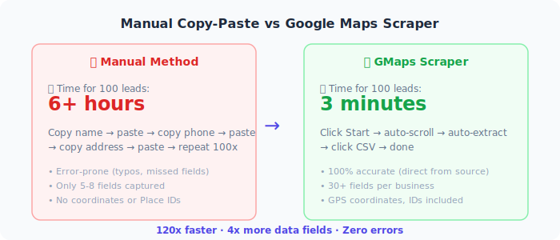
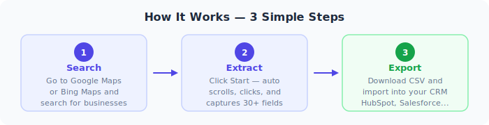
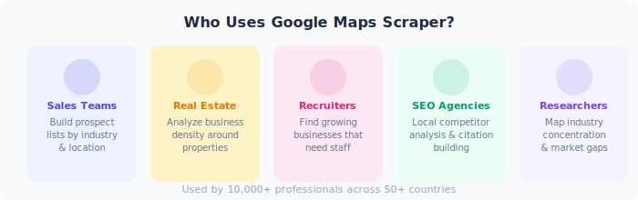

<p align="center">
  
</p>

<p align="center">
  🌍 <a href="languages/README.de.md">Deutsch</a> | <a href="languages/README.fr.md">Français</a> | <a href="languages/README.es.md">Español</a> | <a href="languages/README.ja.md">日本語</a> | <a href="languages/README.ko.md">한국어</a> | <a href="languages/README.pt-br.md">Português</a> | <a href="languages/README.it.md">Italiano</a>
</p>

<p align="center">
  <a href="https://github.com/gmapsscraper/google-maps-scraper"></a>
  <a href="https://github.com/gmapsscraper/google-maps-scraper/blob/main/LICENSE"></a>
  <a href="https://microsoftedge.microsoft.com/addons/detail/maps-leads-extractor/pjfinnoomaapaljalipcldkcpankhnaj"></a>
  <a href="https://gmapsscraper.io"></a>
</p>

<p align="center">
  <strong>Extract 1,000+ business leads from Google Maps & Bing Maps in under 3 minutes.</strong><br>
  Names, phones, emails, websites, ratings, reviews, coordinates — exported to CSV with one click.
</p>

---

## What is Google Maps Scraping?

**Google Maps scraping** is the process of automatically extracting business information from Google Maps search results. Instead of manually copying business names, phone numbers, and addresses one by one, a Google Maps scraper automates the entire process — turning hours of tedious work into minutes of automated data collection.

Every day, millions of businesses are listed on Google Maps with rich, publicly available data: contact information, customer reviews, operating hours, website URLs, and precise geographic coordinates. For sales teams, marketing agencies, and entrepreneurs, this data represents a goldmine of potential leads and market intelligence.

### Why Businesses Need Google Maps Data

The demand for Google Maps lead generation has exploded in recent years. Here's why:

- **Sales prospecting**: B2B sales teams use Google Maps data to build targeted prospect lists by industry, location, and rating. A plumbing company in Chicago with 4.5+ stars and 100+ reviews is likely a thriving business ready for B2B services.

- **Market research**: Understanding competitor density, pricing patterns, and customer sentiment across geographic regions helps businesses make data-driven expansion decisions.

- **Local SEO audits**: SEO agencies extract Google Maps data to analyze local search landscapes, identify citation opportunities, and benchmark client performance against competitors.

- **Real estate intelligence**: Agents and investors use business density data to evaluate commercial property locations and neighborhood development trends.

- **Recruitment**: Staffing agencies identify growing businesses (high review velocity, recently claimed listings) as potential clients who may need hiring support.

The challenge? Manually collecting this data is painfully slow. Copying 100 business listings by hand takes 6+ hours. A Google Maps scraper does it in under 3 minutes.

<p align="center">
  
</p>

---

## Features

Our open-source **Google Maps scraper** Chrome extension extracts 30+ data fields from both Google Maps and Bing Maps, giving you comprehensive business intelligence with zero setup.

### Core Capabilities

| Capability | Description |
|-----------|-------------|
| **Dual Platform Support** | Works on both Google Maps and Bing Maps |
| **30+ Data Fields** | Names, phones, websites, ratings, reviews, hours, coordinates, and more |
| **One-Click CSV Export** | Download your data instantly, ready for CRM import |
| **No API Key Required** | Runs entirely in your browser, no external services needed |
| **Configurable Speed** | Adjust scroll and click delays to match your needs |
| **Auto-Scroll & Pagination** | Automatically loads more results by scrolling and paginating |
| **Dark Mode** | Easy on the eyes during long extraction sessions |
| **Draggable Sidebar** | Position the extraction panel anywhere on screen |

### Platform Comparison

| Data Field | Google Maps | Bing Maps |
|-----------|:-----------:|:---------:|
| Business Name | ✅ | ✅ |
| Full Address | ✅ | ✅ |
| Phone Number | ✅ | ✅ |
| Website URL | ✅ | ✅ |
| Star Rating | ✅ | ✅ |
| Review Count | ✅ | ✅ |
| Categories | ✅ | ✅ |
| Opening Hours | ✅ | ✅ |
| Latitude/Longitude | ✅ | ✅ |
| Price Range | ✅ | ✅ |
| Owner Information | ✅ | — |
| Place ID | ✅ | — |
| Plus Code | ✅ | — |
| CID / FID / KGMID | ✅ | — |
| Featured Image | ✅ | — |
| Claimed Status | ✅ | — |

<p align="center">
  
</p>

---

## Use Cases for Google Maps Lead Generation

<p align="center">
  
</p>

### 1. Sales Teams & Lead Generation Agencies

The most common use case for a Google Maps scraper is **B2B lead generation**. Sales development representatives (SDRs) use extracted data to build hyper-targeted prospect lists:

- Search "marketing agencies in Austin, TX" → extract 500 agencies with phone numbers and websites
- Filter by rating (4.0+) and review count (50+) to identify established businesses
- Export to CSV → import into CRM → start outreach sequence

**Result**: Instead of spending a full day building a prospect list manually, your SDR has a qualified list in 10 minutes.

### 2. Real Estate Professionals

Real estate agents and commercial property investors use Google Maps data to:

- Identify business density around potential property listings
- Find businesses that might need larger/better locations (high reviews = growing business)
- Build referral networks with complementary local businesses
- Analyze foot traffic patterns based on business clustering

### 3. Recruiters & Staffing Agencies

Staffing firms extract Google Maps data to identify potential clients:

- Newly opened businesses (few reviews, recently claimed) likely need staff
- Fast-growing businesses (rapid review accumulation) are scaling up
- Businesses with "Now Hiring" in their description are immediate opportunities

### 4. Local SEO Agencies

SEO professionals use Google Maps scraping for:

- **Competitive analysis**: How many competitors does a client face in their local market?
- **Citation building**: Extract business data to ensure NAP (Name, Address, Phone) consistency
- **Review monitoring**: Track competitor review velocity and sentiment
- **Local pack research**: Understand what ranking factors correlate with top-3 map pack positions

### 5. Market Researchers & Consultants

Management consultants and market researchers extract Google Maps data to:

- Map industry concentration by geography
- Analyze pricing patterns across regions
- Identify underserved markets (low business density + high population)
- Track new business openings as economic indicators

---

## How It Works

Extracting business leads from Google Maps takes just 3 simple steps:

### Step 1: Search

Navigate to [Google Maps](https://www.google.com/maps) or [Bing Maps](https://www.bing.com/maps) and search for your target businesses. For example:

- "dentists in Los Angeles"
- "restaurants near Times Square"
- "software companies in Berlin"
- "plumbers in Sydney, Australia"

The more specific your search, the more targeted your leads will be.

### Step 2: Extract

Click the extension icon or use the auto-loaded sidebar. Hit **Start** and watch as the scraper:

1. Reads all visible business listings
2. Automatically scrolls to load more results
3. Clicks into each listing to capture detailed information
4. Handles pagination (especially on Bing Maps)
5. Deduplicates results in real-time

The extraction speed is configurable — increase delays for safer operation, decrease for faster results.

### Step 3: Export

Once extraction is complete, click **CSV** to download your data. The exported file includes all 30+ fields and is ready to import into:

- **CRMs**: HubSpot, Salesforce, Pipedrive, Close
- **Spreadsheets**: Google Sheets, Excel, Airtable
- **Email tools**: Mailchimp, Lemlist, Instantly
- **Custom databases**: PostgreSQL, MySQL, MongoDB

---

## Installation & Quick Start

### Option 1: Edge Add-ons (Recommended)

The fastest way to get started — one click, no configuration:

👉 **[Install from Edge Add-ons](https://microsoftedge.microsoft.com/addons/detail/maps-leads-extractor/pjfinnoomaapaljalipcldkcpankhnaj)**

Works on Microsoft Edge and any Chromium-based browser.

### Option 2: Load from Source Code

For developers who want full control:

```bash
# Clone the repository
git clone https://github.com/gmapsscraper/google-maps-scraper.git

# Open your browser's extension page
# Chrome: chrome://extensions/
# Edge: edge://extensions/
# Brave: brave://extensions/

# Enable "Developer mode" (top right toggle)
# Click "Load unpacked" → select the cloned folder
```

### Quick Start

```
1. Install the extension (Edge Add-ons or from source)
2. Go to Google Maps → search "coffee shops in Manhattan"
3. Click the extension icon → sidebar appears
4. Click "Start" → watch extraction happen
5. Click "CSV" → download your leads file
```

### Configuration

Fine-tune the scraper for your needs:

| Setting | Default | Range | Purpose |
|---------|---------|-------|---------|
| Scroll Delay | 3000ms | 1000-10000ms | Time between scroll actions |
| Click Interval | 2000ms | 800-10000ms | Time between detail clicks |
| Max Results | 200 | 10-2000 | Stop after N results |

**Pro tip**: Use higher delays (5000ms+) when extracting large datasets to avoid rate limiting.

---

## Complete Data Fields Reference

Every business extracted includes up to 30+ structured data fields:

### Contact Information
| Field | Description | Example |
|-------|-------------|---------|
| Name | Business name | "Joe's Pizza" |
| Phone | Primary phone number | "+1 (212) 555-0123" |
| Phones | All listed phone numbers | "+1 (212) 555-0123; +1 (212) 555-0124" |
| Website | Business website URL | "https://joespizza.com" |
| Domain | Extracted domain name | "joespizza.com" |

### Location Data
| Field | Description | Example |
|-------|-------------|---------|
| Full Address | Complete street address | "123 Main St, New York, NY 10001" |
| Street | Street address only | "123 Main St" |
| Municipality | City/town | "New York" |
| Latitude | GPS latitude | "40.7128" |
| Longitude | GPS longitude | "-74.0060" |
| Plus Code | Google Plus Code | "87G8Q2PQ+XX" |
| Time Zone | Business time zone | "America/New_York" |

### Business Details
| Field | Description | Example |
|-------|-------------|---------|
| Categories | Business categories | "Pizza Restaurant, Italian" |
| Price Range | Price level indicator | "$$" |
| Opening Hours | Weekly schedule | "Mon-Fri: 9am-10pm" |
| Description | Business description | "Family-owned since 1975" |
| Claimed | Is listing claimed? | "Yes" |
| Owner | Business owner name | "Joe Smith" |
| Owner Link | Owner's Google profile | URL |

### Reviews & Ratings
| Field | Description | Example |
|-------|-------------|---------|
| Average Rating | Star rating (1-5) | "4.7" |
| Review Count | Total reviews | "1,234" |
| Review URL | Link to reviews | URL |

### Google-Specific IDs
| Field | Description | Use Case |
|-------|-------------|----------|
| Place ID | Google Place ID | API lookups |
| CID | Customer ID | Direct links |
| FID | Feature ID | Internal reference |
| KGMID | Knowledge Graph ID | Entity matching |

---

## Free Open-Source vs Pro Cloud Version

| Feature | Free (Open Source) | Pro (gmapsscraper.io) |
|---------|:------------------:|:---------------------:|
| Basic data extraction | ✅ | ✅ |
| Google Maps support | ✅ | ✅ |
| Bing Maps support | ✅ | ✅ |
| CSV export | ✅ | ✅ |
| 30+ data fields | ✅ | ✅ |
| **Email extraction** | — | ✅ |
| **Social profiles** | — | ✅ |
| **Bulk multi-search** | — | ✅ |
| **Cloud processing** | — | ✅ |
| **API access** | — | ✅ |
| **Scheduled scraping** | — | ✅ |
| **Smart filtering** | — | ✅ |
| **No browser needed** | — | ✅ |
| **Priority support** | — | ✅ |
| Speed | Browser-limited | 1000+ leads/3 min |
| Max results/session | ~200 | Unlimited |

### When to Use the Free Version

- You need basic business data (name, phone, address, website)
- You're extracting small batches (under 200 results)
- You prefer running everything locally
- You want to inspect and modify the source code

### When to Upgrade to Pro

- You need **email addresses** for outreach campaigns
- You need **social media profiles** (Facebook, Instagram, LinkedIn, Twitter)
- You're extracting **thousands of leads** across multiple searches
- You want **hands-free automation** without keeping your browser open
- You need **API integration** with your existing workflow

<p align="center">
  <a href="https://gmapsscraper.io?ref=github-profile">
    
  </a>
</p>

---

## Frequently Asked Questions

### Is it legal to scrape Google Maps?

Scraping publicly available business information from Google Maps is generally considered legal in most jurisdictions. The data you're extracting (business names, phone numbers, addresses) is publicly listed by the businesses themselves. However:

- Always respect robots.txt and rate limits
- Don't use extracted data for spam or harassment
- Comply with your local data protection regulations (GDPR, CCPA)
- Use reasonable delays between requests

Our tool operates at human-browsing speeds and only accesses publicly visible information.

### How many leads can I extract per session?

With the open-source Chrome extension, you can realistically extract **up to 200 results per search session**. This is limited by Google Maps' own pagination and scroll behavior.

With the [Pro cloud version](https://gmapsscraper.io), there's no practical limit — extract thousands of leads across multiple searches simultaneously.

### Does it work on Bing Maps?

Yes. The extension supports both **Google Maps** and **Bing Maps**. It automatically detects which platform you're on and uses the appropriate extraction logic. Bing Maps support includes pagination handling (clicking "Next page" automatically).

### Do I need an API key?

No. The open-source extension runs entirely in your browser with zero external dependencies. No API keys, no accounts, no backend servers. Just install and start extracting.

The [Pro cloud version](https://gmapsscraper.io) handles API management internally — you get a simple dashboard interface.

### What browsers are supported?

The extension works on all Chromium-based browsers:
- Google Chrome
- Microsoft Edge
- Brave
- Opera
- Vivaldi
- Arc

### How accurate is the extracted data?

The extension extracts data directly from what Google Maps or Bing Maps displays, so accuracy matches the source platform. For phone numbers and addresses, accuracy is typically **90%+**. Business hours and ratings are real-time from the platform.

### Can I extract data from multiple cities?

With the open-source version, you search one location at a time. With the [Pro cloud version](https://gmapsscraper.io), you can run **bulk multi-search** — queue up dozens of searches across different cities and let it run automatically.

### How is this different from Outscraper, PhantomBuster, or Apify?

| Tool | Type | Starting Price | Email Extraction |
|------|------|---------------|-----------------|
| **GMaps Scraper (Free)** | Chrome Extension | $0 | — |
| **GMaps Scraper Pro** | Cloud SaaS | $19/mo | ✅ |
| Outscraper | Cloud API | $3/1K records | Extra cost |
| PhantomBuster | Automation | $56/mo | Limited |
| Apify | Developer Platform | Pay-per-use | Separate actor |

Our advantage: **instant setup** (no coding, no API configuration), browser-based extraction for the free version, and significantly lower pricing for the Pro version.

---

## Get Started Today

<table>
<tr>
<td align="center" width="33%">
<h3>🆓 Free & Open Source</h3>
<p>Basic extraction, 30+ fields, CSV export</p>
<a href="https://github.com/gmapsscraper/google-maps-scraper">View on GitHub →</a>
</td>
<td align="center" width="33%">
<h3>📦 Edge Add-ons</h3>
<p>One-click install, no setup needed</p>
<a href="https://microsoftedge.microsoft.com/addons/detail/maps-leads-extractor/pjfinnoomaapaljalipcldkcpankhnaj">Install Now →</a>
</td>
<td align="center" width="33%">
<h3>🚀 Pro Cloud</h3>
<p>Emails, social, bulk, API, automation</p>
<a href="https://gmapsscraper.io?ref=github-profile">Try Free →</a>
</td>
</tr>
</table>

---

<p align="center">
  <sub>Built for sales teams, agencies, and marketers who need leads fast.<br>
  <a href="https://github.com/gmapsscraper/google-maps-scraper">⭐ Star the repo</a> if it saves you time.</sub>
</p>
